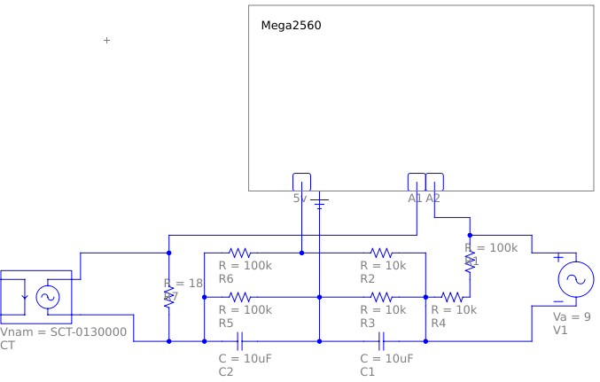

# Energy Monitor
Based off of [Emonlib](https://github.com/openenergymonitor/EmonLib/tree/master), and the [OpenEnergyMonitor project](https://openenergymonitor.org/).
Licensed accordingly.

# Status
This project is currently in pre-alpha and is not currently working.

# Setup
Before starting, it's recommended that you read through the documentation
off of which this project is based: [Open Energy Monitor: Learn: Electricity Monitoring](https://docs.openenergymonitor.org/electricity-monitoring/index.html)

Following OpenEnergyMonitor's guide to building an Arduino Energy Monitor,
setup the following circuit:

With the circuit set up, flash `./energy_monitor.ino` onto your Mega2560
and connect it to the circuit.

With the Mega2560 connected to a computer, the computer should begin
receiving serial messages with readings from the 9vAC PSU, CT, and the
Arduino VCC.

In a terminal, run `python3 ./receiver.py`. This should start reading the
CT's readings and outputting calculations of Apparent Power.

